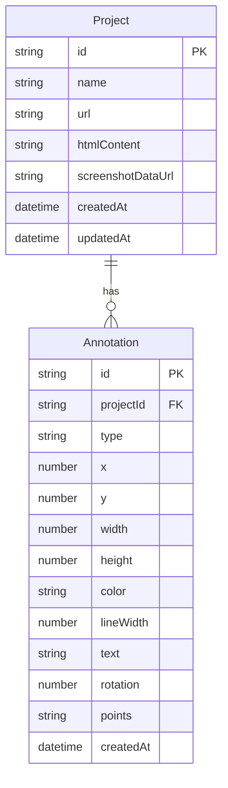

## 1. 架构设计

```mermaid
flowchart TB
    "前端层" --> "状态管理层 (Zustand)"
    "状态管理层" --> "Canvas 渲染层"
    "状态管理层" --> "localStorage 持久化"
    "前端层" --> "html2canvas 截图引擎"
    "前端层" --> "导出模块 (PNG / JSON)"
```

## 2. 技术说明
- 前端：React@18 + TypeScript + tailwindcss@3 + vite
- 初始化工具：vite-init (react-ts 模板)
- 状态管理：Zustand
- 截图引擎：html2canvas
- 后端：无
- 数据库：无（使用 localStorage）

## 3. 路由定义
| 路由 | 用途 |
|------|------|
| / | 主页面，包含所有功能 |

## 4. API 定义
无后端 API，纯前端应用。

## 5. 服务端架构图
不适用

## 6. 数据模型

### 6.1 数据模型定义



### 6.2 数据定义语言

```typescript
type AnnotationType = 'rect' | 'circle' | 'arrow' | 'text' | 'mosaic' | 'pen'

interface Annotation {
  id: string
  projectId: string
  type: AnnotationType
  x: number
  y: number
  width: number
  height: number
  color: string
  lineWidth: number
  text: string
  rotation: number
  points: string
  createdAt: string
}

interface Project {
  id: string
  name: string
  url: string
  htmlContent: string
  screenshotDataUrl: string
  createdAt: string
  updatedAt: string
}
```

## 7. 关键技术决策

### 7.1 截图方案
- 使用 html2canvas 对 iframe 内容截图
- 对于跨域 iframe，提供上传 HTML 文件的替代方案
- 截图结果转为 DataURL 存储

### 7.2 标注渲染
- 使用双层 Canvas：底层渲染截图，上层渲染标注
- 标注数据存储在 Zustand store 中
- 每次标注变更时重新渲染标注层

### 7.3 撤销/重做
- 使用 Zustand 中维护历史栈和重做栈
- 每次标注操作后推入历史栈，清空重做栈
- 撤销时从历史栈弹出推入重做栈，重做时反之

### 7.4 马赛克模糊
- 选中区域后对底层截图的对应区域进行像素化处理
- 使用 Canvas 的 getImageData/putImageData 实现像素采样

### 7.5 导出方案
- PNG：合并截图层和标注层为一张图片，使用 canvas.toDataURL('image/png')
- JSON：序列化标注数据（不含截图图片）为 JSON 文件下载
